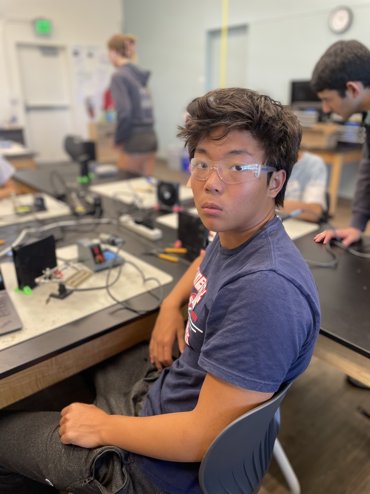
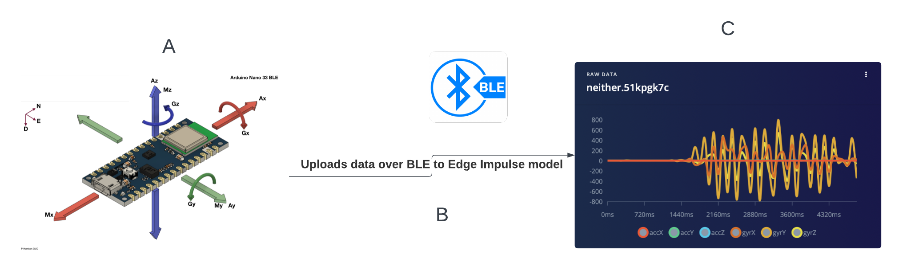

# AI Fitness Band
Allows you to monitor your fitness levels with a tiny, convenient ML-powered fitness band that tracks your activity and provides insights into your health.


| **Engineer** | **School** | **Area of Interest** | **Grade** |
|:--:|:--:|:--:|:--:|
| Daniel W | Lynbrook High | Electrical/Mechanical Engineering | Incoming Junior

<!--**Replace the BlueStamp logo below with an image of yourself and your completed project. Follow the guide [here](https://tomcam.github.io/least-github-pages/adding-images-github-pages-site.html) if you need help.**-->




<!--
# Final Milestone


**Don't forget to replace the text below with the embedding for your milestone video. Go to Youtube, click Share -> Embed, and copy and paste the code to replace what's below.**

<iframe width="560" height="315" src="https://www.youtube.com/embed/F7M7imOVGug" title="YouTube video player" frameborder="0" allow="accelerometer; autoplay; clipboard-write; encrypted-media; gyroscope; picture-in-picture; web-share" allowfullscreen></iframe>

For your final milestone, explain the outcome of your project. Key details to include are:
- What you've accomplished since your previous milestonehttps://www.youtube.com/watch?v=wGviX-kwstI&list=PLe-u_DjFx7etk6dyDuivrw-gQGhkx9TJL&index=51
- What your biggest challenges and triumphs were at BSE
- A summary of key topics you learned about
- What you hope to learn in the future after everything you've learned at BSE


-->
# Second Milestone
<iframe width="560" height="315" src="https://youtu.be/wGviX-kwstI?si=OOS66Woh48r6M3BF" title="YouTube video player" frameborder="0" allow="accelerometer; autoplay; clipboard-write; encrypted-media; gyroscope; picture-in-picture; web-share" allowfullscreen></iframe>

  For my second milestone, I showed that I could collect and upload training data from my Arduino Nano 33 BLE Sense to Edge Impulse in real time via Bluetooth, so that my data collection would not be hindered by the need of a USB cable.

  I first had to find a Python BLE (Bluetooth Low Energy) library compatible with MacOS, so that I could then run a script on my computer to receive the data from the Arduino Nano and upload it to Edge Impulse. After searching, I decided on the bleak library, which offers cross-platform support and is designed with asynchronous programming in mind, allowing for more efficient operations. After that, it was time to create an Arduino sketch to advertise the data, and the resultant Python script to handle it.

  The sketch I used created a union of the data every time it ran, and was always collecting new data and appending the new values. At the start, it would also advertise the Arduino Nano as a BLE device and set a custom name, so that eventually my computer would be able to find it. I would then run the python script which would check for all nearby BLE devices, and find the one with the correct name (my Arduino Nano). 


  
  The script would then access the Arduino Nano, and collect data from it for a period of time that the user would specify. Then, the script would create a json file, a standard format accepted by Edge Impulse, with all the collected data, and upload it all to Edge Impulse.



  Deciding on how to properly identify the device was a challenge, as I was originally planning to search for devices based on their MAC Addresses. However, I soon learned that my operating system (macOS) was incapable of doing so, and so instead I had to switch my method. Eventually, after installing some software such as Bluetility on my computer that could check for nearby BLE devices, I realized that identifying by name would be easiest. In the Arduino sketch, I set the device name as “ARDUINO NANO”, and entered the name as a system argument whenever I ran the script to collect data. Next up, I’m planning to deploy the model on the Arduino IDE, and modify the code to link with the nRF app, an app capable of connecting to bluetooth devices, so that I’m able to use it from my phone.


# First Milestone
<iframe width="560" height="315" src="https://youtu.be/QTPHC-oMB-E?si=v5WvfDkO1T3Y8by0" title="YouTube video player" frameborder="0" allow="accelerometer; autoplay; clipboard-write; encrypted-media; gyroscope; picture-in-picture; web-share" allowfullscreen></iframe>

  To start my project, I showed that I could predict two shoulder movements (lateral raise and chest fly) in real time using Edge Impulse with data from my Arduino Nano 33 BLE Sense.
  
  I connected my Arduino Nano to my computer in order to collect data and link it with Edge Impulse, so that I could then train a model to recognize accelerometer and gyroscope data. I decided to just directly collect data with my Nano connected to the computer via a USB cable for now, and collect more data via Bluetooth later.
  
  I first had to install the proper CLI's, or command line interfaces, for both Edge Impulse and Arduino. This required a lot of troubleshooting over a few days. Since I was using an outdated version of MacOS, I had to use a version of Homebrew different from standard tutorials to install everything. Once that was done, I made sure to flash the firmwares for the Edge Impulse CLI and the Arduino CLI, and then it was time to begin the data collecting process.

  
  
Figure 1: Above is the impulse design.

    
  Since the Arduino still had to be connected to the computer with a cable, (this restricted my movement,  something to expand upon for my next milestone), I decided to do a few basic shoulder movements and train my model. I had three classes, or movements: lateral raises, chest flies, and a third category called "neither" in which I would do day-to-day movements or not move my arm at all. I then created my impulse using a basic classifier and feature extractor. First, I preprocessed my data using a low-pass filter with a cut-off frequency of 20 hertz. I made sure to optimize my model to the proper amount of features, as well as fine-tune my data in order to maximize efficiency. 

  

  
Figure 2: Above is the data before and after filtering. The filter reduces noise and produces a much smoother profile.
  
  In the classifier, I made sure to adjust the learning rate and epoch count accordingly, so that my model would minimize loss while learning fast enough. A learning rate is how much the model adjusts, and I needed to change it because it was too small before and wouldn’t learn enough. Epoch and learning rate are hyperparameters, which are some of the parameters in machine learning.
  
  
Figure 3: Above is my classifier design. I had to adjust the learning rate so that it is less sensitive to features since I have a lot of different features (i.e. accelerometers and gyroscopes), and also increase epoch count so that it learns for longer.
  
Figure 4: Above is the final deployment, I had to make sure to also deploy on my device itself.

  
  After training, it was time for deployment. I first deployed it on the Arduino IDE, so that I could run it directly from there. The final step was to also deploy it on the Arduino Nano itself, and flash its firmware so that I could also run the full impulse from the terminal directly using the command $ edge-impulse-run-impulse. The model is now able to predict which movement I'm doing, but is still hindered by the need of a cable. Next up, I'm planning to make both data collection and deployment available via bluetooth. My main challenges during this process were flashing all the necessary firmware, especially during deployment.


# Starter Project

<iframe width="560" height="315" src="https://www.youtube.com/embed/wGviX-kwstI?si=v7bMy-6ZhwkNnDPd" title="YouTube video player" frameborder="0" allow="accelerometer; autoplay; clipboard-write; encrypted-media; gyroscope; picture-in-picture; web-share" referrerpolicy="strict-origin-when-cross-origin" allowfullscreen></iframe>

I made a basic, calculator for my starter project. This was mainly used for practice with soldering and other basic skills. The calculator itself has the four basic functions and a clear button. During the process, I ended up not using the provided socket and decided to solder the IC in directly, in order to save time as well as give the calculator a sleeker profile. This project succeeded in teaching the basics of soldering and electrical components, and was good preparation for the tasks ahead.

When pressed, the buttons on the circuit board allow the the flow of electricity through resistors, transistors and other components into an integrated circuit, which detects the newfound change in voltage. The IC then runs the input through a series of logic computations in order to compute the intended output, which is then displayed on an LCD screen.

The challenge of this project was the precision required when soldering the components. Some of the pins were very close together, and I would accidentally solder them together, creating a short circuit. Thankfully, I was able to remove the excess solder, and this issue was soon resolved.

<!--
# Schematics 
Here's where you'll put images of your schematics. [Tinkercad](https://www.tinkercad.com/blog/official-guide-to-tinkercad-circuits) and [Fritzing](https://fritzing.org/learning/) are both great resoruces to create professional schematic diagrams, though BSE recommends Tinkercad becuase it can be done easily and for free in the browser. 

# Code
Here's where you'll put your code. The syntax below places it into a block of code. Follow the guide [here]([url](https://www.markdownguide.org/extended-syntax/)) to learn how to customize it to your project needs. 

```c++
void setup() {
  // put your setup code here, to run once:
  Serial.begin(9600);
  Serial.println("Hello World!");
}

void loop() {
  // put your main code here, to run repeatedly:

}
```
-->

# Bill of Materials

| **Part** | **Note** | **Price** | **Link** |
|:--:|:--:|:--:|:--:|
| Arduino Nano 33 BLE Sense Rev2 | Collecting sensor data | $44.50 | <a href="https://www.amazon.com/Arduino-Nano-Sense-headers-ABX00070/dp/B0BQHZ88WD"> Link </a> |
| Anker PowerCore 5000 | charging | $21.99 | <a href="https://www.amazon.com/Anker-PowerCore-Ultra-Compact-High-Speed-Technology/dp/B01CU1EC6Y?th=1"> Link </a> |
<!--
| Item Name | What the item is used for | $Price | <a href="https://www.amazon.com/Arduino-A000066-ARDUINO-UNO-R3/dp/B008GRTSV6/"> Link </a> |

# Other Resources/Examples
One of the best parts about Github is that you can view how other people set up their own work. Here are some past BSE portfolios that are awesome examples. You can view how they set up their portfolio, and you can view their index.md files to understand how they implemented different portfolio components.
- [Example 1](https://trashytuber.github.io/YimingJiaBlueStamp/)
- [Example 2](https://sviatil0.github.io/Sviatoslav_BSE/)
- [Example 3](https://arneshkumar.github.io/arneshbluestamp/)

To watch the BSE tutorial on how to create a portfolio, click here.
-->
