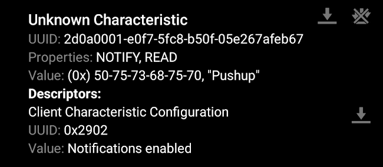

# AI Fitness Band
Allows you to monitor your fitness levels with a tiny, convenient ML-powered fitness band that tracks your activity and provides insights into your health.


| **Engineer** | **School** | **Area of Interest** | **Grade** |
|:--:|:--:|:--:|:--:|
| Daniel W | Lynbrook High | Electrical/Mechanical Engineering | Incoming Junior

<!--**Replace the BlueStamp logo below with an image of yourself and your completed project. Follow the guide [here](https://tomcam.github.io/least-github-pages/adding-images-github-pages-site.html) if you need help.**-->


# Final Milestone


<iframe width="560" height="315" src="https://www.youtube.com/embed/WozYNT2VAfE?si=FXxkaz73QLR63Mwb" title="YouTube video player" frameborder="0" allow="accelerometer; autoplay; clipboard-write; encrypted-media; gyroscope; picture-in-picture; web-share" referrerpolicy="strict-origin-when-cross-origin" allowfullscreen></iframe>

  For my third milestone, I deployed my final model that can detect pushups, squats, and resting position, and then send the inference data over BLE to the nRF Connect app on my phone.

  I first had to retrain my model with the data that I had collected via BLE previously. I made sure to lower my learning rate and batch size, while also drastically increasing the epoch count so that my model could find as general of a solution as possible. 


> Figure 1: Above is the impulse design, showing the dropout and hidden layers as well as the data explorer.

  To make sure that my model didn’t just memorize the parameters of my training data, I added in a few dropout layers, which randomly disable certain neurons and ensure that the model generates more robust features. After training, it was time to deploy my model on my Arduino Nano, and also modify the sketch to then send the inferences to my phone.

  After getting the fusion sensor example from my deployed model (which gathers data from all sensors), I then had to find a way to include BLE so that the inferences would be sent to my phone. I found little guidance online, as I was using a different version of an Arduino Nano than most. Eventually, I found how to write values to the nRF app.



> Figure 2: Above is a screenshot from the nRF app, showing how the value of the characteristic was changed to the corresponding inference.

  Figuring out where exactly to send the inferences and where to read it was the biggest challenge. I soon discovered that I was able to write values to the inference characteristic I had defined in my sketch. Even after that, it took a lot of fidgeting with the app in order to enable notifications for the characteristic before I was finally able to show the data.

  Working on this project over the past several weeks has helped me learn more about the engineering process. The biggest takeaway I have is that you shouldn’t be afraid to ask others for help. Before, I’d worked mainly on projects with myself or just a few other people, and I’d never asked people who weren’t also doing my task to help. The challenges that came with this project helped me become more comfortable with expressing my frustrations and forgo the sense of embarrassment that came from asking others for help. The challenges, particularly the Bluetooth data collection and deployment, were extremely taxing but made me feel a great sense of triumph after completing them. In the future, I hope to become even more collaborative while expanding my skill set to other branches of engineering.


# Second Milestone
<iframe width="560" height="315" src="https://www.youtube.com/embed/Y0rCxOON5dc?si=B7cWHj8KtdUClGIV" title="YouTube video player" frameborder="0" allow="accelerometer; autoplay; clipboard-write; encrypted-media; gyroscope; picture-in-picture; web-share" referrerpolicy="strict-origin-when-cross-origin" allowfullscreen></iframe>

  For my second milestone, I showed that I could collect and upload training data from my Arduino Nano 33 BLE Sense to Edge Impulse in real time via Bluetooth, so that my data collection would not be hindered by the need of a USB cable.

  I first had to find a Python BLE (Bluetooth Low Energy) library compatible with MacOS, so that I could then run a script on my computer to receive the data from the Arduino Nano and upload it to Edge Impulse. After searching, I decided on the bleak library, which offers cross-platform support and is designed with asynchronous programming in mind, allowing for more efficient operations. After that, it was time to create an Arduino sketch to advertise the data, and the resultant Python script to handle it.

  The sketch I used created a union of the data every time it ran, and was always collecting new data and appending the new values. At the start, it would also advertise the Arduino Nano as a BLE device and set a custom name, so that eventually my computer would be able to find it. I would then run the python script which would check for all nearby BLE devices, and find the one with the correct name (my Arduino Nano). 

  
  The script would then access the Arduino Nano, and collect data from it for a period of time that the user would specify. Then, the script would create a json file, a standard format accepted by Edge Impulse, with all the collected data, and upload it all to Edge Impulse.


> Figure 3: Arduino Nano (A) sends data over BLE (B) and uploads it to Edge Impulse (C)

  Deciding on how to properly identify the device was a challenge, as I was originally planning to search for devices based on their MAC Addresses. However, I soon learned that my operating system (macOS) was incapable of doing so, and so instead I had to switch my method. Eventually, after installing some software such as Bluetility on my computer that could check for nearby BLE devices, I realized that identifying by name would be easiest. In the Arduino sketch, I set the device name as “ARDUINO NANO”, and entered the name as a system argument whenever I ran the script to collect data. Next up, I’m planning to deploy the model on the Arduino IDE, and modify the code to link with the nRF app, an app capable of connecting to bluetooth devices, so that I’m able to use it from my phone.


# First Milestone
<iframe width="560" height="315" src="https://www.youtube.com/embed/QTPHC-oMB-E?si=b488i-esRmzSUsCn" title="YouTube video player" frameborder="0" allow="accelerometer; autoplay; clipboard-write; encrypted-media; gyroscope; picture-in-picture; web-share" referrerpolicy="strict-origin-when-cross-origin" allowfullscreen></iframe>

  To start my project, I showed that I could predict two shoulder movements (lateral raise and chest fly) in real time using Edge Impulse with data from my Arduino Nano 33 BLE Sense.
  
  I connected my Arduino Nano to my computer in order to collect data and link it with Edge Impulse, so that I could then train a model to recognize accelerometer and gyroscope data. I decided to just directly collect data with my Nano connected to the computer via a USB cable for now, and collect more data via Bluetooth later.
  
  I first had to install the proper CLI's, or command line interfaces, for both Edge Impulse and Arduino. This required a lot of troubleshooting over a few days. Since I was using an outdated version of MacOS, I had to use a version of Homebrew different from standard tutorials to install everything. Once that was done, I made sure to flash the firmwares for the Edge Impulse CLI and the Arduino CLI, and then it was time to begin the data collecting process.

  
  
  
> Figure 4: Above is the impulse design.

    
  Since the Arduino still had to be connected to the computer with a cable, (this restricted my movement,  something to expand upon for my next milestone), I decided to do a few basic shoulder movements and train my model. I had three classes, or movements: lateral raises, chest flies, and a third category called "neither" in which I would do day-to-day movements or not move my arm at all. I then created my impulse using a basic classifier and feature extractor. First, I preprocessed my data using a low-pass filter with a cut-off frequency of 20 hertz. I made sure to optimize my model to the proper amount of features, as well as fine-tune my data in order to maximize efficiency. 

  

  
  
> Figure 5: Above is the data before and after filtering. The filter reduces noise and produces a much smoother profile.
  
  In the classifier, I made sure to adjust the learning rate and epoch count accordingly, so that my model would minimize loss while learning fast enough. A learning rate is how much the model adjusts, and I needed to change it because it was too small before and wouldn’t learn enough. Epoch and learning rate are hyperparameters, which are some of the parameters in machine learning.
  
  
  
> Figure 6: Above is my classifier design. I had to adjust the learning rate so that it is less sensitive to features since I have a lot of different features (i.e. accelerometers and gyroscopes), and also increase epoch count so that it learns for longer.
  
  After training, it was time for deployment. I first deployed it on the Arduino IDE, so that I could run it directly from there. The final step was to also deploy it on the Arduino Nano itself, and flash its firmware so that I could also run the full impulse from the terminal directly using the command $ edge-impulse-run-impulse. The model is now able to predict which movement I'm doing, but is still hindered by the need of a cable. Next up, I'm planning to make both data collection and deployment available via bluetooth. My main challenges during this process were flashing all the necessary firmware, especially during deployment.

# Bill of Materials

| **Part** | **Note** | **Price** | **Link** |
| :--: | :--: | :--: | :--: |
| Arduino Nano 33 BLE Sense Rev2 | Collecting Sensor Data | $44.50 | <a href="https://www.amazon.com/Arduino-Nano-Sense-headers-ABX00070/dp/B0BQHZ88WD"> Link </a> |
| Anker PowerCore 5000 | Charging | $21.99 | <a href="https://www.amazon.com/Anker-PowerCore-Ultra-Compact-High-Speed-Technology/dp/B01CU1EC6Y?th=1"> Link </a> |


# Starter Project

<iframe width="560" height="315" src="https://www.youtube.com/embed/wGviX-kwstI?si=v7bMy-6ZhwkNnDPd" title="YouTube video player" frameborder="0" allow="accelerometer; autoplay; clipboard-write; encrypted-media; gyroscope; picture-in-picture; web-share" referrerpolicy="strict-origin-when-cross-origin" allowfullscreen></iframe>

I made a basic, calculator for my starter project. This was mainly used for practice with soldering and other basic skills. The calculator itself has the four basic functions and a clear button. During the process, I ended up not using the provided socket and decided to solder the IC in directly, in order to save time as well as give the calculator a sleeker profile. This project succeeded in teaching the basics of soldering and electrical components, and was good preparation for the tasks ahead.

When pressed, the buttons on the circuit board allow the the flow of electricity through resistors, transistors and other components into an integrated circuit, which detects the newfound change in voltage. The IC then runs the input through a series of logic computations in order to compute the intended output, which is then displayed on an LCD screen.

The challenge of this project was the precision required when soldering the components. Some of the pins were very close together, and I would accidentally solder them together, creating a short circuit. Thankfully, I was able to remove the excess solder, and this issue was soon resolved.


# Code
Below is the python script used to collect data from the Arduino Nano over BLE.
```python
import asyncio
import json
import hmac
import hashlib
import requests
import struct
import sys
import time
from bleak import BleakClient, BleakScanner

# Validate command-line arguments
if len(sys.argv) != 4:
    print("Fatal, must pass device name, file name, and duration:", sys.argv[0], "<device name> <file name> <duration>")
    quit()

# Define BLE service and characteristic UUIDs
accelServiceUuid = "2BEEF31A-B10D-271C-C9EA-35D865C1F48A"
accCharUuid = "4664E7A1-5A13-BFFF-4636-7D0A4B16496C"

# Define API and HMAC keys (replace with actual keys)
HMAC_KEY = "202dd8b23e7713f84ed4b067d7e1ee1e"
API_KEY = "ei_ef13ceabb7e7fe91f64a5808efe2067641859389d6fe85316a267dbd221b5116"

# Set device name, measurement name, and measurement duration from command-line arguments
device_name = sys.argv[1]
NAME = sys.argv[2]
TIME = int(sys.argv[3])

# Set data collection interval (in milliseconds)
INTERVAL_MS = 90

# Validate interval
if INTERVAL_MS <= 0:
    raise Exception("Interval in milliseconds cannot be equal or lower than 0.")

# Calculate number of samples to collect based on duration and interval
freq = 1000 / INTERVAL_MS
values_list = []

async def main(device_name):
    print("Scanning for devices...")
    
    # Find all nearby BLE devices, await allows tasks to be completed at the same time
    devices = await BleakScanner.discover()
    found_device = None
    
    # Checks if any of the devices is the correct one
    for device in devices:
        if device.name == device_name:
            found_device = device
            break

    if not found_device:
        print(f"Device with name '{device_name}' not found.")
        return

    print(f"Device '{device_name}' found. Connecting...")

    # Set up data collection
    async with BleakClient(found_device.address) as client:
        print("Connected to device")
        for i in range(TIME * int(round(freq, 0))):
            sensorData = await client.read_gatt_char(accCharUuid)
            sensorValues = [sensorData[i:i+4] for i in range(0, len(sensorData), 4)]
            acc_x = struct.unpack('f', sensorValues[0])[0]
            acc_y = struct.unpack('f', sensorValues[1])[0]
            acc_z = struct.unpack('f', sensorValues[2])[0]
            gyr_x = struct.unpack('f', sensorValues[3])[0]
            gyr_y = struct.unpack('f', sensorValues[4])[0]
            gyr_z = struct.unpack('f', sensorValues[5])[0]
            values_list.append([acc_x * 9.865, acc_y * 9.865, acc_z * 9.865, gyr_x, gyr_y, gyr_z])
            await asyncio.sleep(INTERVAL_MS / 1000)

    # Create data structure for JSON
    data = {
        "protected": {
            "ver": "v1",
            "alg": "HS256",
            "iat": time.time()  # epoch time, seconds since 1970
        },
        "signature": ''.join(['0'] * 64),  # placeholder signature
        "payload": {
            "device_name": device_name,
            "device_type": "BLE_TEST_DEVICE",
            "interval_ms": INTERVAL_MS,
            "sensors": [
                {"name": "accX", "units": "m/s2"},
                {"name": "accY", "units": "m/s2"},
                {"name": "accZ", "units": "m/s2"},
                {"name": "gyrX", "units": "deg/s"},
                {"name": "gyrY", "units": "deg/s"},
                {"name": "gyrZ", "units": "deg/s"}
            ],
            "values": values_list
        }
    }

    # Encode data as JSON
    encoded = json.dumps(data)

    # Sign JSON data using HMAC
    signature = hmac.new(bytes(HMAC_KEY, 'utf-8'), msg=encoded.encode('utf-8'), digestmod=hashlib.sha256).hexdigest()

    # Update signature in data structure
    data['signature'] = signature
    encoded = json.dumps(data)

    # Upload data to API
    res = requests.post(url='https://ingestion.edgeimpulse.com/api/training/data',
                        data=encoded,
                        headers={
                            'Content-Type': 'application/json',
                            'x-file-name': NAME,
                            'x-api-key': API_KEY
                        })

    # Check API response and print appropriate message
    if res.status_code == 200:
        print('Uploaded file to Edge Impulse', res.status_code, res.content)
    else:
        print('Failed to upload file to Edge Impulse', res.status_code, res.content)

# Run the asyncio event loop
device_name = sys.argv[1]
asyncio.run(main(device_name))

```


Below is the code that gets the inferences and uploads them over BLE to the nRF connect app.

```c++
/* Edge Impulse ingestion SDK
 * Copyright (c) 2023 EdgeImpulse Inc.
 *
 * Licensed under the Apache License, Version 2.0 (the "License");
 * you may not use this file except in compliance with the License.
 * You may obtain a copy of the License at
 * http://www.apache.org/licenses/LICENSE-2.0
 *
 * Unless required by applicable law or agreed to in writing, software
 * distributed under the License is distributed on an "AS IS" BASIS,
 * WITHOUT WARRANTIES OR CONDITIONS OF ANY KIND, either express or implied.
 * See the License for the specific language governing permissions and
 * limitations under the License.
 *
 */

/* Includes ---------------------------------------------------------------- */
#include <fitness_band_inferencing.h>
#include <Arduino_BMI270_BMM150.h> //Click here to get the library: https://www.arduino.cc/reference/en/libraries/arduino_bmi270_bmm150/
#include <Arduino_LPS22HB.h> //Click here to get the library: https://www.arduino.cc/reference/en/libraries/arduino_lps22hb/
#include <Arduino_HS300x.h> //Click here to get the library: https://www.arduino.cc/reference/en/libraries/arduino_hs300x/
#include <Arduino_APDS9960.h> //Click here to get the library: https://www.arduino.cc/reference/en/libraries/arduino_apds9960/
#include <ArduinoBLE.h>
BLEService inferenceService("2d0a0000-e0f7-5fc8-b50f-05e267afeb67");  
BLEStringCharacteristic inferenceCharacteristic("2d0a0001-e0f7-5fc8-b50f-05e267afeb67", BLERead | BLENotify, 56);
enum sensor_status {
    NOT_USED = -1,
    NOT_INIT,
    INIT,
    SAMPLED
};

/** Struct to link sensor axis name to sensor value function */
typedef struct{
    const char *name;
    float *value;
    uint8_t (*poll_sensor)(void);
    bool (*init_sensor)(void);    
    sensor_status status;
} eiSensors;

/* Constant defines -------------------------------------------------------- */
#define CONVERT_G_TO_MS2    9.80665f
#define MAX_ACCEPTED_RANGE  2.0f        // starting 03/2022, models are generated setting range to +-2,
                                        // but this example use Arudino library which set range to +-4g. 
                                        // If you are using an older model, ignore this value and use 4.0f instead
/** Number sensor axes used */
#define N_SENSORS     18

/* Forward declarations ------------------------------------------------------- */
float ei_get_sign(float number);

bool init_IMU(void);
bool init_HTS(void);
bool init_BARO(void);
bool init_APDS(void);

uint8_t poll_acc(void);
uint8_t poll_gyr(void);
uint8_t poll_mag(void);
uint8_t poll_HTS(void);
uint8_t poll_BARO(void);
uint8_t poll_APDS_color(void);
uint8_t poll_APDS_proximity(void);
uint8_t poll_APDS_gesture(void);

/* Private variables ------------------------------------------------------- */
static const bool debug_nn = false; // Set this to true to see e.g. features generated from the raw signal

static float data[N_SENSORS];
static bool ei_connect_fusion_list(const char *input_list);

static int8_t fusion_sensors[N_SENSORS];
static int fusion_ix = 0;

/** Used sensors value function connected to label name */
eiSensors sensors[] =
{
    "accX", &data[0], &poll_acc, &init_IMU, NOT_USED,
    "accY", &data[1], &poll_acc, &init_IMU, NOT_USED,
    "accZ", &data[2], &poll_acc, &init_IMU, NOT_USED,
    "gyrX", &data[3], &poll_gyr, &init_IMU, NOT_USED,
    "gyrY", &data[4], &poll_gyr, &init_IMU, NOT_USED,
    "gyrZ", &data[5], &poll_gyr, &init_IMU, NOT_USED,
    "magX", &data[6], &poll_mag, &init_IMU, NOT_USED,
    "magY", &data[7], &poll_mag, &init_IMU, NOT_USED,
    "magZ", &data[8], &poll_mag, &init_IMU, NOT_USED,

    "temperature", &data[9], &poll_HTS, &init_HTS, NOT_USED,
    "humidity", &data[10], &poll_HTS, &init_HTS, NOT_USED,

    "pressure", &data[11], &poll_BARO, &init_BARO, NOT_USED,

    "red", &data[12], &poll_APDS_color, &init_APDS, NOT_USED,
    "green", &data[13], &poll_APDS_color, &init_APDS, NOT_USED,
    "blue", &data[14], &poll_APDS_color, &init_APDS, NOT_USED,
    "brightness", &data[15], &poll_APDS_color, &init_APDS, NOT_USED,
    "proximity", &data[16], &poll_APDS_proximity, &init_APDS, NOT_USED,
    "gesture", &data[17], &poll_APDS_gesture,&init_APDS, NOT_USED,
};

/**
* @brief      Arduino setup function
*/
void setup()
{
    /* Init serial */
    Serial.begin(9600);
    // comment out the below line to cancel the wait for USB connection (needed for native USB)
    Serial.println("Edge Impulse Sensor Fusion Inference\r\n");

    /* Connect used sensors */
    if(ei_connect_fusion_list(EI_CLASSIFIER_FUSION_AXES_STRING) == false) {
        ei_printf("ERR: Errors in sensor list detected\r\n");
        return;
    }

    /* Init & start sensors */

    for(int i = 0; i < fusion_ix; i++) {
        if (sensors[fusion_sensors[i]].status == NOT_INIT) {
            sensors[fusion_sensors[i]].status = (sensor_status)sensors[fusion_sensors[i]].init_sensor();
            if (!sensors[fusion_sensors[i]].status) {
              ei_printf("%s axis sensor initialization failed.\r\n", sensors[fusion_sensors[i]].name);             
            }
            else {
              ei_printf("%s axis sensor initialization successful.\r\n", sensors[fusion_sensors[i]].name);
            }
        }
    }
    if (!BLE.begin()) {   // initialize BLE
      Serial.println("starting BLE failed!");
      while (1);
    }
    BLE.setLocalName("EI-FITNESS_BAND"); 
    BLE.setConnectionInterval(160, 200);
    BLE.setAdvertisedService(inferenceService); // Advertise service
    inferenceService.addCharacteristic(inferenceCharacteristic); // Add characteristic to service
    BLE.addService(inferenceService); // Add service
    inferenceCharacteristic.writeValue("inference"); // Set first value string
    //Set the advertising interval in units of 0.625 ms
    //Bluetooth LE advertising interval around 50ms
    BLE.setAdvertisingInterval(80);
    BLE.advertise();  // Start advertising
}


void sendInferenceOverBLE(String inferenceResult) {
  
    inferenceCharacteristic.writeValue(inferenceResult); // Write value
        
}

/**
* @brief      Get data and run inferencing
*/
void loop()
{
    BLEDevice central = BLE.central();
    String inferenceResult = "";
    if (central.discoverAttributes()) {
      // turn on the LED to indicate the connection:
      digitalWrite(LED_BUILTIN, HIGH);

      while (central.connected()) {
        ei_printf("\nStarting inferencing in 2 seconds...\r\n");

        delay(2000);

        if (EI_CLASSIFIER_RAW_SAMPLES_PER_FRAME != fusion_ix) {
          ei_printf("ERR: Sensors don't match the sensors required in the model\r\n"
          "Following sensors are required: %s\r\n", EI_CLASSIFIER_FUSION_AXES_STRING);
          return;
        }

        ei_printf("Sampling...\r\n");
        sendInferenceOverBLE("Sampling");
        
        // Allocate a buffer here for the values we'll read from the sensor
        
        float buffer[EI_CLASSIFIER_DSP_INPUT_FRAME_SIZE] = { 0 };
        for (size_t ix = 0; ix < EI_CLASSIFIER_DSP_INPUT_FRAME_SIZE; ix += EI_CLASSIFIER_RAW_SAMPLES_PER_FRAME) {
          // Determine the next tick (and then sleep later)
          int64_t next_tick = (int64_t)micros() + ((int64_t)EI_CLASSIFIER_INTERVAL_MS * 1000);

          for(int i = 0; i < fusion_ix; i++) {
              if (sensors[fusion_sensors[i]].status == INIT) {
                  sensors[fusion_sensors[i]].poll_sensor();
                  sensors[fusion_sensors[i]].status = SAMPLED;
              }
              if (sensors[fusion_sensors[i]].status == SAMPLED) {
                  buffer[ix + i] = *sensors[fusion_sensors[i]].value;
                  sensors[fusion_sensors[i]].status = INIT;
              }
          }

          int64_t wait_time = next_tick - (int64_t)micros();

          if(wait_time > 0) {
    
              delayMicroseconds(wait_time);
          }
      }
      
      // Turn the raw buffer in a signal which we can the classify
        signal_t signal;
        int err = numpy::signal_from_buffer(buffer, EI_CLASSIFIER_DSP_INPUT_FRAME_SIZE, &signal);
        if (err != 0) {
          ei_printf("ERR:(%d)\r\n", err);
          return;
        }
      
      // Run the classifier
        ei_impulse_result_t result = { 0 };
        err = run_classifier(&signal, &result, debug_nn);
        Serial.println("test");  
        if (err != EI_IMPULSE_OK) {
          ei_printf("ERR:(%d)\r\n", err);
          return;
        }
      
        // print the predictions
        ei_printf("Predictions (DSP: %d ms., Classification: %d ms., Anomaly: %d ms.):\r\n",
          result.timing.dsp, result.timing.classification, result.timing.anomaly);   
        for (size_t ix = 0; ix < EI_CLASSIFIER_LABEL_COUNT; ix++) {
          ei_printf("%s: %.5f\r\n", result.classification[ix].label, result.classification[ix].value);
          if(result.classification[ix].value >0.7 && inferenceResult != result.classification[ix].label){
                inferenceResult = result.classification[ix].label;
                sendInferenceOverBLE(inferenceResult);
                delay(1000);
          }
        }
#if EI_CLASSIFIER_HAS_ANOMALY == 1
    ei_printf("    anomaly score: %.3f\r\n", result.anomaly);
#endif
    }
  }
}

#if !defined(EI_CLASSIFIER_SENSOR) || (EI_CLASSIFIER_SENSOR != EI_CLASSIFIER_SENSOR_FUSION && EI_CLASSIFIER_SENSOR != EI_CLASSIFIER_SENSOR_ACCELEROMETER)
#error "Invalid model for current sensor"
#endif


/**
 * @brief Go through sensor list to find matching axis name
 *
 * @param axis_name
 * @return int8_t index in sensor list, -1 if axis name is not found
 */
static int8_t ei_find_axis(char *axis_name)
{
    int ix;
    for(ix = 0; ix < N_SENSORS; ix++) {
        if(strstr(axis_name, sensors[ix].name)) {
            return ix;
        }
    }
    return -1;
}

/**
 * @brief Check if requested input list is valid sensor fusion, create sensor buffer
 *
 * @param[in]  input_list      Axes list to sample (ie. "accX + gyrY + magZ")
 * @retval  false if invalid sensor_list
 */
static bool ei_connect_fusion_list(const char *input_list)
{
    char *buff;
    bool is_fusion = false;

    /* Copy const string in heap mem */
    char *input_string = (char *)ei_malloc(strlen(input_list) + 1);
    if (input_string == NULL) {
        return false;
    }
    memset(input_string, 0, strlen(input_list) + 1);
    strncpy(input_string, input_list, strlen(input_list));

    /* Clear fusion sensor list */
    memset(fusion_sensors, 0, N_SENSORS);
    fusion_ix = 0;

    buff = strtok(input_string, "+");

    while (buff != NULL) { /* Run through buffer */
        int8_t found_axis = 0;

        is_fusion = false;
        found_axis = ei_find_axis(buff);

        if(found_axis >= 0) {
            if(fusion_ix < N_SENSORS) {
                fusion_sensors[fusion_ix++] = found_axis;
                sensors[found_axis].status = NOT_INIT;
            }
            is_fusion = true;
        }

        buff = strtok(NULL, "+ ");
    }

    ei_free(input_string);

    return is_fusion;
}

/**
 * @brief Return the sign of the number
 * 
 * @param number 
 * @return int 1 if positive (or 0) -1 if negative
 */
float ei_get_sign(float number) {
    return (number >= 0.0) ? 1.0 : -1.0;
}

bool init_IMU(void) {
  static bool init_status = false;
  if (!init_status) {
    init_status = IMU.begin();
  }
  return init_status;
}

bool init_HTS(void) {
  static bool init_status = false;
  if (!init_status) {
    init_status = HS300x.begin();
  }
  return init_status;
}

bool init_BARO(void) {
  static bool init_status = false;
  if (!init_status) {
    init_status = BARO.begin();
  }
  return init_status;
}

bool init_APDS(void) {
  static bool init_status = false;
  if (!init_status) {
    init_status = APDS.begin();
  }
  return init_status;
}

uint8_t poll_acc(void) {
  
    if (IMU.accelerationAvailable()) {

    IMU.readAcceleration(data[0], data[1], data[2]);

    for (int i = 0; i < 3; i++) {
        if (fabs(data[i]) > MAX_ACCEPTED_RANGE) {
            data[i] = ei_get_sign(data[i]) * MAX_ACCEPTED_RANGE;
        }
    }

    data[0] *= CONVERT_G_TO_MS2;
    data[1] *= CONVERT_G_TO_MS2;
    data[2] *= CONVERT_G_TO_MS2;
    }

    return 0;
}

uint8_t poll_gyr(void) {
  
    if (IMU.gyroscopeAvailable()) {
        IMU.readGyroscope(data[3], data[4], data[5]);
    }
    return 0;
}

uint8_t poll_mag(void) {
  
    if (IMU.magneticFieldAvailable()) {
        IMU.readMagneticField(data[6], data[7], data[8]);
    }
    return 0;
}

uint8_t poll_HTS(void) {
  
    data[9] = HS300x.readTemperature();
    data[10] = HS300x.readHumidity();
    return 0;
}

uint8_t poll_BARO(void) {
  
    data[11] = BARO.readPressure(); // (PSI/MILLIBAR/KILOPASCAL) default kPa
    return 0;
}

uint8_t poll_APDS_color(void) {
  
    int temp_data[4];
    if (APDS.colorAvailable()) {
        APDS.readColor(temp_data[0], temp_data[1], temp_data[2], temp_data[3]);

        data[12] = temp_data[0];
        data[13] = temp_data[1];
        data[14] = temp_data[2];
        data[15] = temp_data[3];
    }
}

uint8_t poll_APDS_proximity(void) {

    if (APDS.proximityAvailable()) {
        data[16] = (float)APDS.readProximity();
    }
    return 0;
}

uint8_t poll_APDS_gesture(void) {
    if (APDS.gestureAvailable()) {
        data[17] = (float)APDS.readGesture();
    }
    return 0;
}
```


<!--

# Other Resources/Examples
One of the best parts about Github is that you can view how other people set up their own work. Here are some past BSE portfolios that are awesome examples. You can view how they set up their portfolio, and you can view their index.md files to understand how they implemented different portfolio components.
- [Example 1](https://trashytuber.github.io/YimingJiaBlueStamp/)
- [Example 2](https://sviatil0.github.io/Sviatoslav_BSE/)
- [Example 3](https://arneshkumar.github.io/arneshbluestamp/)

To watch the BSE tutorial on how to create a portfolio, click here.
-->
